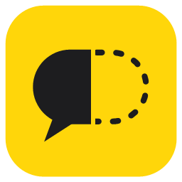

<p align="center"></p>

<h1 align="center">QuickVoice</h1>

<p align="center"><b>Controle o Windows pela voz. Ele age antes de você terminar a frase.</b></p>

<p align="center">
  <a href="https://github.com/theuslpszbr15/QuickVoice/releases/latest"></a>
  <a href="https://github.com/theuslpszbr15/QuickVoice/actions/workflows/ci.yml"></a>
  <a href="LICENSE"></a>
  <br><a href="README.en.md">English</a>
</p>

<p align="center"><a href="docs/demo.mp4"></a><br><sub><a href="docs/demo.mp4">Ver o vídeo em alta resolução (MP4)</a></sub></p>

Diga "abre o bloco de notas e digita bom dia": o Bloco de Notas já abre enquanto você
ainda está dizendo "digita", e "bom dia" é digitado na pausa. Grátis, sem conta e sem
chave de API: por padrão, as decisões são tomadas no seu PC.

Inspirado no [partway](https://github.com/tostechbr/partway) (macOS, Swift), portado para
Windows (.NET 10 + WPF). Opcionalmente usa o [Jev](https://typesafe.ai/blog/introducing-system-one-models-and-jev),
o System One da TypeSafe, para entender frases mais soltas.

## O que dá pra dizer

| Frase | O que acontece |
|---|---|
| "abre o bloco de notas", "open spotify" | abre o app, muitas vezes antes de você terminar a frase |
| "cria uma nota nova", "new tab" | Ctrl+N no app em primeiro plano |
| "abre o linkedin no google", "open x dot com" | abre o site |
| "pesquisa receita de pão de queijo" | pesquisa no navegador em primeiro plano (ou no padrão) |
| "digita bom dia" | digita no app em primeiro plano |
| "digita oi vírgula tudo bem ponto de interrogação" | digita "oi, tudo bem?" (pontuação falada) |
| "fecha isso", "fecha a aba", "minimiza", "maximiza", "troca de janela", "mostra a área de trabalho" | controla a janela em frente |
| "aumenta o volume", "volume 30", "muta" | som |
| "próxima música", "pausa a música", "música anterior" | teclas de mídia (Spotify, YouTube…) |
| "tira um print", "bloqueia o computador" | print salvo em Imagens → Capturas de Tela; tela de bloqueio |
| "clica em salvar", "clica no botão enviar" | clica no botão, link ou menu com esse nome na janela em frente |
| "modo ditado" … "fim do ditado" | tudo o que você falar no meio é digitado, a cada pausa |
| suas frases | seus atalhos (veja abaixo) |

Encadeie numa frase só: "abre o terminal e digita dir", "abre o spotify e aumenta o volume".
Se o app já está aberto, "abre…" traz a janela para frente em vez de abrir outra.

**Modo de escrever:** aperte **Alt+Shift+Espaço** (ou o botão ⌨ na pílula, ou o menu da bandeja),
escreva o comando, por exemplo "Pesquise no google sobre o dólar", e aperte **Enter**. Esc cancela.
O comando passa pelo mesmo motor da voz, e o foco volta para o app em que você estava, então
"digita…" escreve lá.

## Instalar e usar

**Baixe o instalador** em [Releases](https://github.com/theuslpszbr15/QuickVoice/releases/latest)
(`QuickVoice-Setup-x.y.z.exe`, não pede administrador) ou a versão portátil (`.zip`, é só extrair e abrir
`QuickVoice.exe`). Requisitos: Windows 10 2004+ ou Windows 11 (64 bits). Não precisa instalar o .NET.

**Sem pagar nada:** sem chave, as decisões vêm de regras locais (`LocalDecider`): grátis,
offline e instantâneas. Com uma chave paga do Jev ([console.typesafe.ai](https://console.typesafe.ai/keys)),
ele passa a decidir e entende frases mais soltas: ícone na bandeja → "Usar chave do Jev". Controles do
sistema, cliques e atalhos continuam nas regras locais.

1. Uma pílula flutua no topo da tela. Aperte **Alt+Espaço** (ou **Ctrl+Alt+Espaço**, se outro
   app já usa Alt+Espaço, como o PowerToys Run) ou o botão ▶ e fale.
2. Na primeira vez, o Windows pede duas permissões. O próprio app abre a página certa:
   - **Configurações → Privacidade e segurança → Fala → Reconhecimento de fala online: Ativado**
     (o ditado contínuo do Windows precisa disso; com o Whisper, não).
   - **Configurações → Privacidade e segurança → Microfone → Permitir que apps da área de
     trabalho acessem o microfone**.
3. O idioma é o da fala do Windows (pt-BR e en-US testados). Troque em **Configurações** do
   QuickVoice ou com `--locale en-US`.

O ícone na bandeja (perto do relógio) começa/pausa com um clique; o botão direito tem
"Escrever um comando", "Configurações…", "Editar meus atalhos…", "Usar chave do Jev…" e "Sair".
Arraste a pílula para qualquer lugar.

### Configurações

Bandeja → **Configurações…** (salvas em `%APPDATA%\QuickVoice\config.json`):

- **Idioma da fala.**
- **Reconhecimento:** Windows (online, o mais rápido) ou **Whisper (offline)**: roda o
  [whisper.cpp](https://github.com/ggml-org/whisper.cpp) no seu PC e nada sai dele. O modelo (tiny 75 MB,
  base 140 MB ou small 470 MB) é baixado uma vez. No Whisper as parciais chegam a cada ~1 s, então
  abrir apps no meio da frase acontece um pouco mais tarde.
- **Atalho para ouvir:** Alt+Espaço, Ctrl+Alt+Espaço ou Ctrl+Shift+Espaço.
- **Palavra de ativação:** sempre ouvindo, age só quando a frase começa com "QuickVoice"
  ("QuickVoice, abre o chrome"). Você escolhe o nome e as variações.

### Seus atalhos

Bandeja → **Editar meus atalhos…** abre `%APPDATA%\QuickVoice\atalhos.json` no Bloco de notas.
Cada atalho tem frases e o que fazer, em ordem: abrir uma pasta, arquivo, programa ou site; digitar
um texto; apertar teclas. Salvou, já vale.

```jsonc
[
  { "frases": ["abre meu projeto", "meu projeto"], "abrir": "%USERPROFILE%\\Projetos\\site" },
  { "frases": ["assinatura do email"], "digitar": "Atenciosamente,\nMatheus" },
  { "frases": ["salva tudo"], "teclas": "ctrl+shift+s" }
]
```

### Rodar pelo código

Com o [.NET 10 SDK](https://dotnet.microsoft.com/download):

```powershell
dotnet run --project src/QuickVoice
```

Uma versão nova sai sozinha ao criar uma tag `v*` (`git tag v1.2.0; git push --tags`): o
[workflow de release](.github/workflows/release.yml) roda os testes, gera o instalador (Inno Setup,
[`installer/QuickVoice.iss`](installer/QuickVoice.iss)) e o `.zip`, e publica em Releases. Todo push roda
build e testes no [CI](.github/workflows/ci.yml).

O ícone (balão de fala meio dito, meio tracejado, como o do original) sai de `scripts/make-icon.ps1`,
que gera `src/QuickVoice/app.ico`.

## Como ele decide

A lógica em `src/QuickVoice.Core` é um port 1:1 do `PartwayCore`, com os mesmos testes.
Quem responde "o que fazer" é um `IDecider`: as regras locais (`LocalDecider`, padrão) ou o Jev.

- Cada transcrição parcial vira uma pergunta: qual ação, qual app, quais
  palavras são o argumento, e um sim/não "pede para abrir um app?".
- Abrir app dispara no meio da frase quando duas parciais seguidas concordam e o app é
  nomeado sem dúvida (≥ 0,95). Novo item precisa de 0,85.
- Pesquisa, site e digitação esperam a pausa (600 ms): "pesquisa norbert" não é
  "pesquisa norbert wiener" até você parar.
- Na pausa ele age pelo **resultado**, não pelo rótulo: ir ao LinkedIn, pesquisar por ele ou
  abrir o navegador citado dão no mesmo lugar, então as probabilidades somam.
- Nada escreve texto por conta própria: o código corta os trechos do que você disse, o decisor
  escolhe um, e ele é copiado literalmente.
- Controles do sistema, cliques e atalhos são lidos só pelas regras locais (`Controls`, `LocalDecider`)
  e agem na pausa. "clica em…" procura o nome pela UI Automation do Windows na janela em frente.

## Diferenças para o original (macOS → Windows)

| partway (macOS) | QuickVoice (Windows) |
|---|---|
| Apple Speech (`SFSpeechRecognizer`) | `Windows.Media.SpeechRecognition` (ditado contínuo, com hipóteses parciais) ou Whisper offline |
| `/Applications/*.app` | pasta `shell:AppsFolder` (Menu Iniciar: apps Win32 e da Store, com nomes já no idioma do Windows) |
| `NSWorkspace.openApplication` | `explorer.exe shell:AppsFolder\<id>` |
| `CGEvent` (precisa de Acessibilidade) | `SendInput` Unicode (sem permissão extra; não digita em janelas de administrador) |
| ⌘N | Ctrl+N |
| ⌥Space | Alt+Espaço, ou Ctrl+Alt+Espaço |
| barra de menus | ícone na bandeja |
| Jev (pago) decide tudo | regras locais grátis por padrão; Jev opcional |
| chave em `~/.config/partway/api-key` (0600) | `%APPDATA%\QuickVoice\api-key.bin`, criptografada com DPAPI |
| `~/Library/Logs/partway` | `%LOCALAPPDATA%\QuickVoice\Logs` |
| — | modo de escrever (Alt+Shift+Espaço) |
| — | controles do sistema, clicar por nome, ditado, atalhos próprios, palavra de ativação |

## Testar sem microfone

```powershell
dotnet run --project src/QuickVoice -- --text "abre o chrome e pesquisa receita de pão de queijo" --dry-run --log
dotnet test
```

`--text` manda a frase palavra por palavra no ritmo da fala (`--wpm 160`), ou de uma vez com
`--write`; `--dry-run`
mostra os comandos sem executá-los; `--log` grava um `.jsonl` local com tudo o que foi
ouvido (eventos: start, heard, ask, answer, fire, run, pause, end, error).

## Privacidade

Com o reconhecimento do Windows, a fala vira texto pelo serviço online da Microsoft; com o
**Whisper**, tudo fica no PC. Com as regras locais, nada mais sai do PC; só com uma chave do Jev as
palavras vão para a TypeSafe. Com a palavra de ativação ligada o microfone fica sempre aberto (o que
não começa com o nome é descartado). `--log` fica desligado por padrão e, quando ligado, guarda tudo o
que o microfone ouvir.

## Limitações

- "clica em…" depende do app expor seus botões pela UI Automation (a maioria expõe; jogos e
  alguns apps em Electron/Java, não).
- Não digita nem clica em janelas de administrador (o Windows bloqueia).
- Texto que soa como tarefa ("escreve lista de compras") pode não fazer nada, e a onda
  sonora é decorativa (como no original).
- Se o Windows reescrever palavras no resultado final (ex.: "dois" → "2"), os deslocamentos
  de palavras mudam; o app compara as palavras normalizadas para minimizar isso.

## Licença

[MIT](LICENSE), mantendo o aviso do projeto original ([partway](https://github.com/tostechbr/partway), de Tiago Oliveira).
